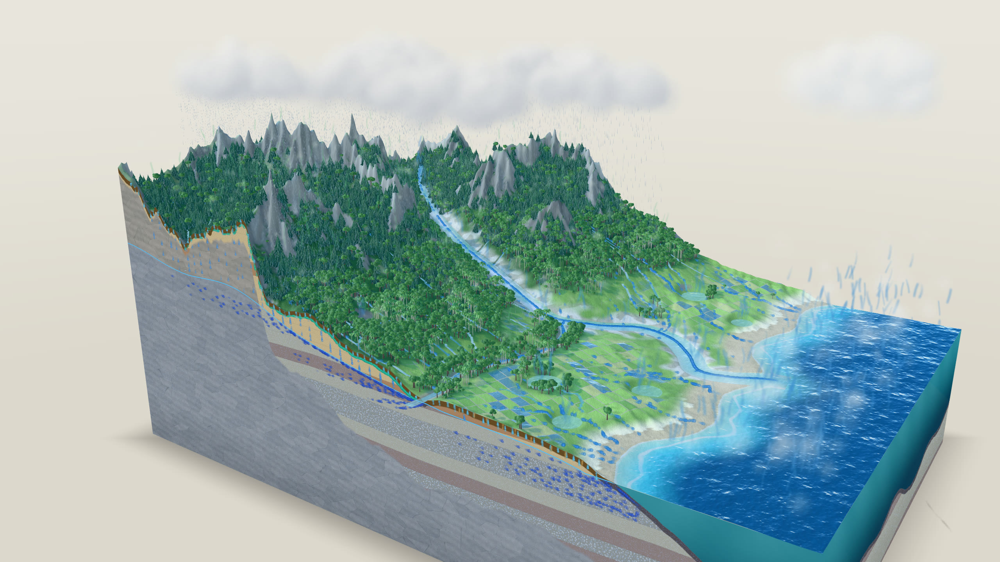

# Hydrology Happy Learn・水文學自學

用全螢幕投影片、Three.js 3D 模型、互動實驗和教學影片，自學大學《水文學》。

**網站：<https://hydrology-happy-learn.pages.dev/>**（直接用瀏覽器打開就能看，不用下載任何東西）



## 內容

依課本十章規劃，目前完成第 1 章：

| 單元 | 內容 | 互動實驗 | 影片 |
|---|---|---|---|
| 1-1 水文循環 | 11 個過程：降水、截留、窪蓄、入滲、漫地流、中間流、滲漏、地下水、出滲、蒸發、蒸散；汽體與液體傳輸；圖 1-2 流程 | 一場降雨的水帳：調降雨強度、延時、入滲容量、土壤有效容量，看漫地流、中間流與歷線怎麼變（Horton 四種情況） | 7 分 22 秒 |
| 1-2 水文平衡方程式 | 系統觀念、式 (1-1)～(1-4)、入滲為什麼相消、用水深記帳、例題 1.1 | 洪水通過水庫：入流、放流、溢洪道與蓄水量 | 7 分 56 秒 |
| 1-3 模擬、應用與台灣 | 模式分類、集塊與分佈、水文學的應用、台灣地形與水文特性（真實 SRTM 地形）、流量累積曲線 | 水庫要蓋多大：用 Rippl 法求所需容量 | 9 分 04 秒 |

每個單元是一組全螢幕投影片：`→`／`←` 換頁，`G` 總覽，`F` 全螢幕，`V` 看影片。

3D 場景的地形是程序生成後再跑水力侵蝕模擬，漫地流沿著 D8 流向的真實流路移動；台灣地形來自 SRTM 衛星高程資料。互動實驗背後是簡化的教學示意模型，不是校正過的水文模式。

## 課本出處

本站是依據一本中文大學教科書《水文學》第 1、2 章製作的**個人自學筆記**。內容以自己的話重寫、圖表為重新繪製，課本原文、原圖與習題的著作權屬於原作者與出版社。本 repo 不包含課本的掃描或照片。

## 部署

程式碼放在這個 GitHub repo，網站由 Cloudflare Pages 從 repo 自動部署：push 到 `main` 後大約 30 秒就會更新到 <https://hydrology-happy-learn.pages.dev/>（建置指令留空，輸出目錄 `site`）。影片小段經 Cloudflare 的 CDN 快取，各地載入都快。

影片只放 HLS（`site/media/<章>/<單元>/hls/`）：Cloudflare Pages 單一檔案上限 25 MiB，也不支援 Range 請求，mp4 放上去無法拖曳。推上去之前執行：

```bash
node tools/check.mjs
```

會檢查檔案大小、檔案數和所有連結。

### 在自己電腦上開發（只有要修改網站時才需要）

需要 Python 3（只用標準函式庫）：

```bash
python tools/serve.py
```

然後打開 <http://127.0.0.1:8790/>。Windows 也可以直接雙擊 `serve.bat`，Mac 用 `serve.command`。

網站是純 HTML、CSS、JavaScript（ES modules），沒有建置步驟；three.js、hls.js 和字型都在 `site/vendor/`，可以完全離線使用。

## 怎麼做的

| 檔案 | 用途 |
|---|---|
| `site/assets/deck.js`、`deck.css` | 全螢幕投影片引擎（1920×1080 等比縮放、分段出現、總覽、影片播放器） |
| `site/scenes/lib/` | 共用 3D 工具：雜訊、網格水文演算（侵蝕、填窪、D8、流量累積、Strahler）、粒子水流、程序樹木、水面 |
| `site/scenes/hydro-cycle/` | 1-1 水文循環方塊圖、降雨示意模型與參數面板 |
| `site/scenes/reservoir/` | 1-2、1-3 水庫場景、洪水演算面板、流量累積曲線面板 |
| `site/scenes/taiwan/` | 1-3 台灣真實地形 |
| `production/<章>/<單元>/script.json` | 影片旁白稿：每一句對應投影片的頁與段 |
| `tools/make_video.py` | 影片製作：edge-tts 旁白 → 時間軸 → 以虛擬時鐘逐格擷取投影片 → 配樂混音 → MP4 |
| `tools/publish-video.sh` | 母帶轉成 1080p HLS、擷取封面 |
| `tools/subset_fonts.py` | 從思源黑體／宋體抽出網站用到的字，做成小 woff2 |
| `DESIGN.md` | 設計書與製作紀錄 |

影片就是同一組投影片自動播放錄下來的，網站和影片共用同一份來源。製作影片需要 opus-video 的 conda 環境（Playwright、FFmpeg、edge-tts）。

## 授權

- 程式碼（`site/` 的 HTML／CSS／JS、`tools/`）：[MIT](LICENSE)
- 教學內容（投影片文字、影片、旁白稿）：保留所有權利，僅供個人學習觀看，未經同意請勿轉載或改作
- 第三方元件、字型、地形資料與語音：見 [NOTICE.md](NOTICE.md)

網站與影片由作者與 [Claude Code](https://claude.com/claude-code)（Anthropic Claude）協作完成。
